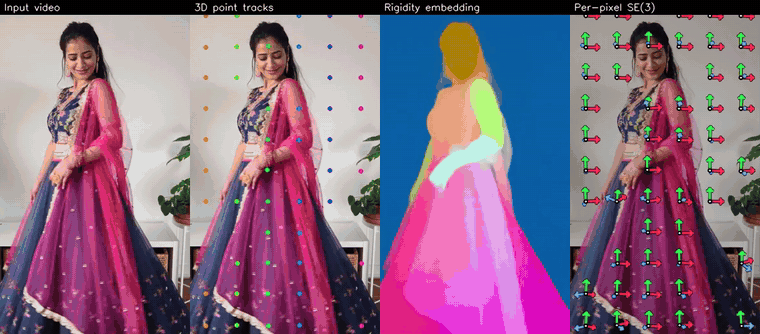

<div align="center">
<h1>MoSE3: Learning World-Space SE(3) at Every Pixel</h1>
<h3>NeurIPS 2026 (Spotlight)</h3>

<a href="https://arxiv.org/abs/2610.03716"></a>
<a href="https://mose3-tracker.github.io/"></a>
<a href="https://huggingface.co/JoannaCCCCCC/MoSE3"></a>

[Joanna Jiahuan Cheng](https://joannaccjh.github.io/)\*, [Zhiyi Li](https://sky-lzy.github.io/)\*, [Tian Xia](https://tianx-ia.github.io/)\*, [Ruojin Cai](https://ruojincai.github.io/), [Yilun Du](https://yilundu.github.io/), [Qianqian Wang](https://qianqianwang68.github.io/)

\* Equal contribution
</div>

<p align="center">
  
</p>

## Updates

- **[Oct 2026]** Inference code and model weights released.

## Overview

**MoSE3** is a feed-forward model that predicts world-space **SE(3) motion for every pixel** of a
monocular RGB video, generalizing across **rigid, articulated and deformable objects**.

## Quick Start

### Installation

```bash
git clone https://github.com/mose3-tracker/MoSE3.git
cd MoSE3
uv venv --python 3.10
uv pip install -e .              # inference + visualization (torch 2.6.0, CUDA 12.6 wheels)
uv pip install -e ".[demo]"      # + interactive 3D viewer (visualize_viser.py)
uv pip install -e ".[app]"       # + Gradio app (gradio_app.py)
```

Or with conda and pip:

```bash
conda create -n mose3 python=3.10 -y
conda activate mose3
pip install torch==2.6.0 --index-url https://download.pytorch.org/whl/cu126   # tested with CUDA 12.6
pip install -e ".[demo,app]"
```

No custom CUDA extension is needed. The editable install makes `mose3` importable from anywhere.

### Model weights

Download the weights from [Hugging Face](https://huggingface.co/JoannaCCCCCC/MoSE3) into `ckpt/`:

```bash
hf download JoannaCCCCCC/MoSE3 --local-dir ckpt
```

### Run

```bash
# 1. inference: video -> outputs/spin/predictions.npz
python inference.py --ckpt ckpt --video examples/spin.mp4 --num_frames 40

# 2. 2D visualizations -> outputs/spin/{tracks,se3,rigidity}.mp4
python visualize.py --clip outputs/spin

# 3. interactive 3D viewer -> http://localhost:8080
python visualize_viser.py --clip outputs/spin --port 8080
```

- Inputs: `--video`, `--image_dir` (frames ordered by the numbers in their file names), or `--json`
  with a list of clips (same keys as the flags; see `examples/demo.json`).
- SE(3) fit: `--num_ref_pts` (default 12000) is the number of query-frame pixels each fit pools over.
  For locally deforming surfaces such as cloth, add `--se3_dist_weight` to also weight that pool by
  pixel distance (`--se3_sigma_px`, default 8 px). The `demo.json` clips use it.
- `python inference.py --help` lists every option. The keys of `predictions.npz` are documented in
  `run_clip` in `inference.py`.

### Gradio app

`gradio_app.py` serves a drag & drop UI: drop a video (or a set of frames) and it returns `tracks.mp4`,
plus the SE(3) and rigidity visualizations.

```bash
python gradio_app.py --ckpt ckpt --port 7860     # http://127.0.0.1:7860
```

### End-to-end tests

With the weights in `ckpt/` and a CUDA GPU:

```bash
pip install -e ".[test]"
playwright install chromium
pytest -m e2e -v
```

`tests/test_inference_e2e.py` runs `inference.py` and `visualize.py` on `examples/spin.mp4` and on
frames extracted from `assets/teaser_dress.gif`, checking the prediction shapes, the SE(3) identity
at the query frame, and the rendered videos. `tests/test_gradio_app_e2e.py` drives `gradio_app.py`
in a real browser with Playwright, dropping a video and then frames onto the UI and checking the
returned `tracks.mp4`.

### In Python

```python
import torch
from mose3.models.mose3 import MoSE3
from mose3.utils.per_point_se3 import fit_per_pixel_se3

model = MoSE3.from_pretrained("ckpt", strict=True).cuda().eval()   # local folder
# model = MoSE3.from_pretrained("JoannaCCCCCC/MoSE3", strict=True).cuda().eval()   # or straight from the Hub

imgs = ...  # (1, N, 3, H, W) float in [0, 1]; H and W multiples of 14
with torch.no_grad(), torch.autocast("cuda", dtype=torch.bfloat16):
    out = model(imgs, query_frame_idx=0)   # the frame whose pixels are tracked

tracks_local = out["tracks_local"][0].float()   # (N, H, W, 3) 3D track of every query pixel, in each frame's camera
rigidity_emb = out["rigidity_emb"][0].float()   # (N, H, W, 16)

# express the tracks in the first camera's coordinate frame, then fit a rigid transform per query pixel
c2w = out["camera_poses"][0].float()
c2w = torch.linalg.inv(c2w[:1]) @ c2w
tracks = torch.einsum("tij,thwj->thwi", c2w[:, :3, :3], tracks_local) + c2w[:, None, None, :3, 3]
se3 = fit_per_pixel_se3(tracks, rigidity_emb, query_idx=0)   # sigma_px=8.0: also weight by pixel distance

se3["quat"], se3["trans"]   # (N, H, W, 4) wxyz and (N, H, W, 3): x_t = R x_query + t, in the first camera's frame
```

## Visualization

Both tools read only `predictions.npz` and lay a grid of query points over the query frame
(`--stride`, default 48 px).

`visualize.py` writes, each video as `input | visualization`:

- `query_points.png`: the grid on the query frame
- `tracks.mp4`: the predicted 3D tracks with a fading trail (hollow dot = occluded)
- `se3.mp4`: each point's SE(3) motion as a moving x/y/z frame, placed at the query-frame point moved
  by its SE(3); at the query frame blue z is the outward surface normal, and frames of occluded points
  are dashed
- `rigidity.mp4`: rigidity embedding, PCA → RGB

`visualize_viser.py` shows the dense tracks as a moving 3D point cloud, coloured by RGB or by the
rigidity embedding, with the same SE(3) frames and the trails of the tracks. Point size, axis length
and width, and trail lengths are sliders in the GUI.

`--help` lists the options of both tools.

## Checklist

- [x] Inference code and model weights
- [ ] Art-Kubric dataset and generation pipeline
- [ ] Evaluation code
- [ ] Training code

## Acknowledgements

MoSE3 uses [π³](https://github.com/yyfz/Pi3) as its frozen geometry branch, and this repository
includes π³'s model code and weights. It also contains code from
[DINOv2](https://github.com/facebookresearch/dinov2), [CroCo](https://github.com/naver/croco),
[DUSt3R](https://github.com/naver/dust3r) and [marepo](https://github.com/nianticlabs/marepo).
The model is trained on Kubric, PointOdyssey, Dynamic Replica, SynthVerse and Syn4D. The example
videos are from [Pexels](https://www.pexels.com) and the [DyCheck](https://github.com/KAIR-BAIR/dycheck)
iPhone dataset. We thank the authors of all of these.

## Citation

```bibtex
@misc{cheng2026mose3learningworldspacese3,
      title={MoSE3: Learning World-Space SE(3) at Every Pixel},
      author={Jiahuan Cheng and Zhiyi Li and Tian Xia and Ruojin Cai and Yilun Du and Qianqian Wang},
      year={2026},
      eprint={2610.03716},
      archivePrefix={arXiv},
      primaryClass={cs.CV},
      url={https://arxiv.org/abs/2610.03716},
}
```

## License

The code is released under the BSD 3-Clause license, except for a few third-party files that keep
their own licenses (some non-commercial), listed in [LICENSE](LICENSE). The model weights include
π³'s weights and are released under [CC BY-NC 4.0](https://creativecommons.org/licenses/by-nc/4.0/).
